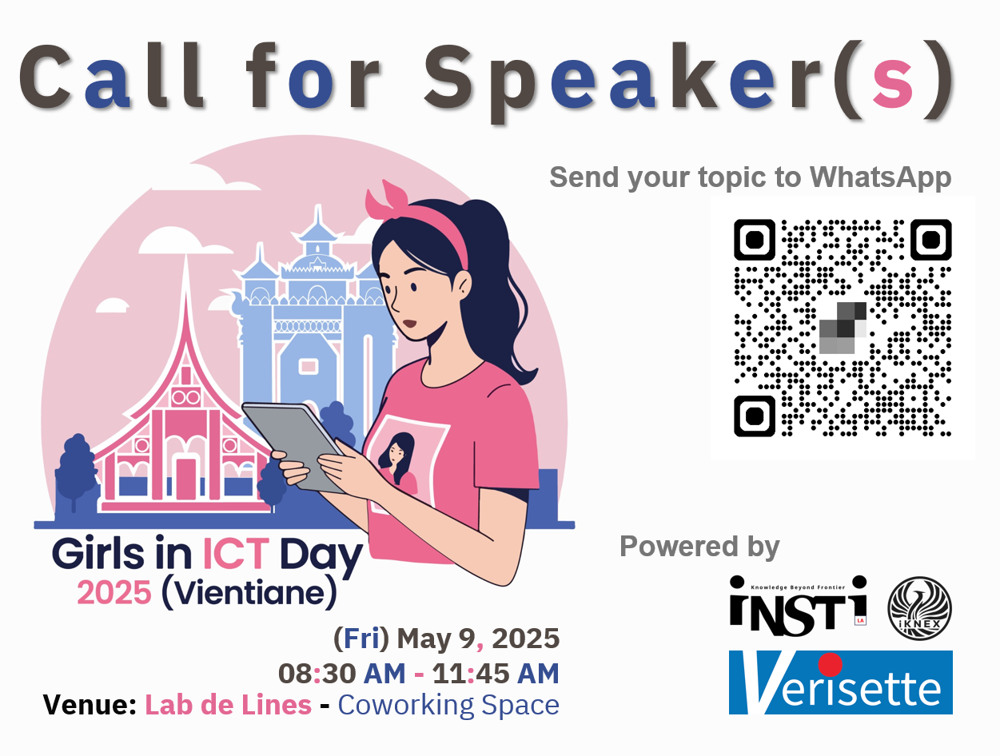

# Girls in ICT Day 2025 (Vientiane) 
### “Girls in ICT for inclusive digital transformation”

| From  |  To   |  Activities/Topics                                                                                       |
|:-----:|:-----:|:---------------------------------------------------------------------------------------------------------|
| 08:45 | 09:00 | **Registration** & ***Lucky Draw***                                                                      |
| 09:00 | 09:15 | **Opening** - ***"Digital Safety & DX require Girls in ICT"***  --- *Maykin Warasart*                 |
| 09:15 | 09:30 | **Switch! and Girls**  --- *Phonesavanh NAMMAKONE*                                                    |
| 09:30 | 10:15 | **Women and Girls in AI**  --- *Asst.Prof.Wanchanok Sunthorn*                                         |
| 10:15 | 10:30 | ***---Break---***                                                                                        |
| 10:30 | 11:00 | **Girls in Wireless Networking**  --- *MK's Angels*                                                   |
| 11:00 | 11:45 | **TBA**                                                                                                  |
| 11:45 | 12:00 | ***Lucky Draw*** & **Closing**                                                                           |

### Confirmed Speaker(s)
+ ***Asst.Prof.*** **Wanchanok Sunthorn**
	+ Digital Media Technology Program, Rajamangala University of Technology Thanyaburi (RMUTT)
	+ PhD candidate in Data Science and Artificial Intelligence, School of Engineering and Technology, Asian Institute of Technology (AIT)

#### Lucky Draw *
+ [Train the Trainer (TtT) Workshop](https://instila.github.io/TtT)
+ [CompTIA Security+ Course](https://ubslao.com/Courses/CompTIA/Security+)
+ [CompTIA Project+ Course](#)