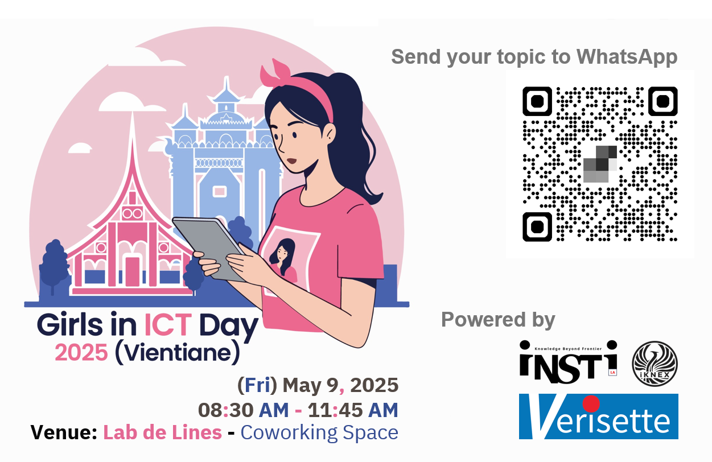

# Girls in ICT Day 2025 (Vientiane) 
### “Girls in ICT for inclusive digital transformation”

[ ")](img/Before-the-Match.png)

| From  |  To   |  Activities/Topics                                                                          |
|:-----:|:-----:|:--------------------------------------------------------------------------------------------|
| 09:00 | 09:15 | **Registration**                                                                            |
| 09:15 | 09:30 | **Opening** - ***"Digital Safety & DX require Girls in ICT"***  --- *Maykin Warasart*    |
| 09:30 | 10:00 | **Switch! and Girls**  --- *Phonesavanh NAMMAKONE*                                       |
| 10:00 | 11:00 | **Women and Girls in AI**  --- *Asst.Prof.Wanchanok Sunthorn*                            |
| 11:00 | 11:15 | ***---Break---***                                                                           |
| 11:15 | 11:45 | **Girls in Wireless Networking**  --- *Mon & Mouk, MK's Angels*                          |
| 11:45 | 12:00 | ***Lucky Draw*** & **Closing**                                                              |

[ ")](img/After-the-Match.png)

### Confirmed Speaker(s)
+ **Maykin Warasart**
	+ Microsoft Most Valuable Professional (MVP) - Security
	+ iNSTi.LA Founder
+ **Phonesavanh NAMMAKONE**
	+ Assistant Sale Manager, Verisette
+ ***Asst.Prof.*** **Wanchanok Sunthorn**
	+ Digital Media Technology Program, Rajamangala University of Technology Thanyaburi (RMUTT)
	+ PhD candidate in Data Science and Artificial Intelligence, School of Engineering and Technology, Asian Institute of Technology (AIT)
+ **Soulintar INSAVANH** & **Duangtavanh THATSAPHONE**
	+ MK's Angels

#### Lucky Draw *
+ [Train the Trainer (TtT) Workshop](https://instila.github.io/TtT)
+ [CompTIA Security+ Course](https://ubslao.com/Courses/CompTIA/Security+)
+ [CompTIA Project+ Course](#)

 ")

 ")

 ")

 ")

 ")

 ")

 ")

 ")

 ")

 ")

 ")