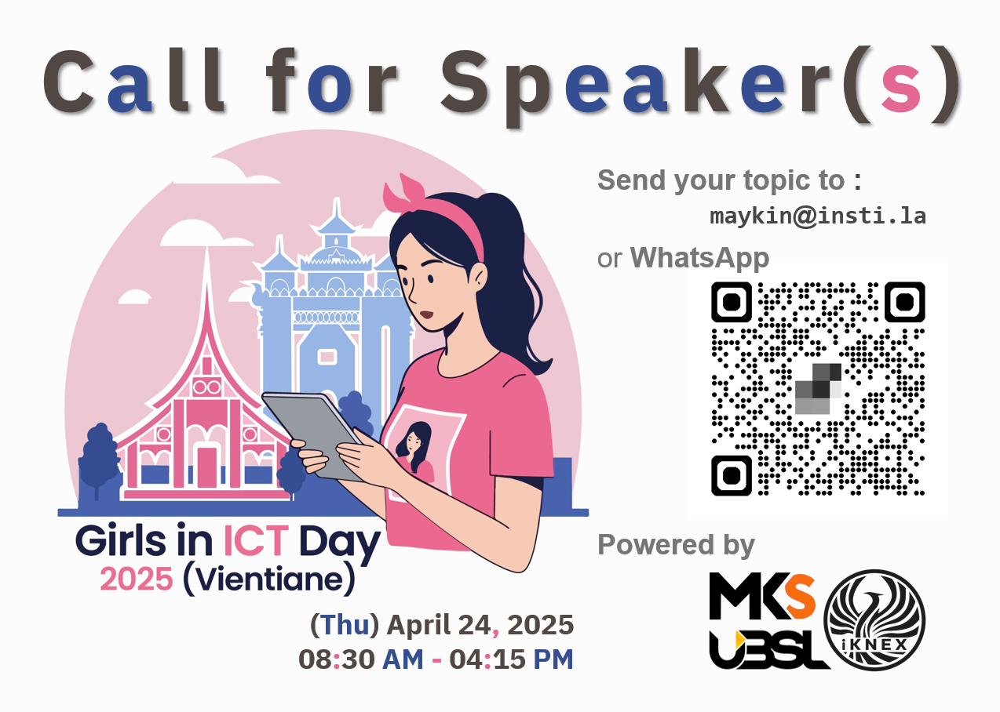

# Girls in ICT Day 2025 (Vientiane) 
### “Girls in ICT for inclusive digital transformation”

| From  |  To   |  Activities/Topics                |
|:-----:|:-----:|:----------------------------------|
| 08:45 | 09:00 | Registration                      |
| 09:00 | 09:15 | Opening, (Lucky Draw)*            |
| 09:15 | 09:30 | Switch and Grils                  |
| 09:30 | 10:15 | Women and Girls in AI             |
| 10:15 | 10:30 | Break                             |
| 10:30 | 11:15 | Women and Girls in Remote Working |
| 11:15 | 11:45 | Girls in Wireless Networking      |
| 11:45 | 13:15 | Lunch                             |
| 13:15 | 13:30 | Lucky Draw*                       |
| 13:30 | 14:30 | Women and Girls in ICT Talk #1    |
| 14:30 | 14:45 | Break                             |
| 14:45 | 15:45 | Women and Girls in ICT Talk #2 	|
| 15:45 | 16:00 | (Lucky Draw)*, Closing            |

### Confirmed Speaker(s)
+ AA
	+ aa
	+ ab
+ BB
	+ ba
	+ bb

#### Lucky Draw*
+ [Train the Trainer (TtT) Workshop](https://instila.github.io/TtT)
+ [CompTIA Security+ Course](https://ubslao.com/Courses/CompTIA/Security+)
+ [CompTIA Project+ Course](#)