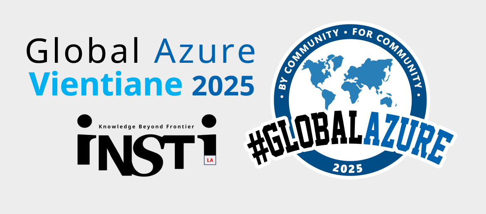

+ CFS : ***[Sessionize](https://sessionize.com/global-azure-vientiane-2025/)***
+ Date : ***(Fri)*** **May 9, 2025**
+ Time : **1:00** PM - **4:15** PM
+ Venue : **LTC** ***(9th floor.)***
+ Registration : ***[Here!](https://forms.gle/hfZxMgrcqca2Qvci8)***

| From  |  To   |  Activities/Topics                                                       |
|:-----:|:-----:|:-------------------------------------------------------------------------|
| 13:00 | 13:35 | **Registration** & ***Lucky Draw***                                      |
| 13:35 | 13:45 | **Welcome note**                                                         |
| 13:45 | 14:30 | **[OpenAI Service models](https://globalazure.net/events/402f91e1-c5aa-497a-83e5-7199106063d1?sessionId=918124)**  --- *Asst.Prof.Wanchanok Sunthorn*         |
| 14:30 | 14:45 | ***Break*** & ***Networking***                                                                                                                                   |
| 14:45 | 15:15 | **[Security in Well-Architected Framework](https://globalazure.net/events/402f91e1-c5aa-497a-83e5-7199106063d1?sessionId=918683)**  --- *Maykin Warasart*     |
| 15:15 | 16:00 | **[Defending Azure](https://globalazure.net/events/402f91e1-c5aa-497a-83e5-7199106063d1?sessionId=918133)**  --- *Thongsavanh VILAYVONG*                      |
| 16:00 | 16:15 | ***Lucky Draw*** & **Closing**                                           |

### Confirmed Speaker(s)
+ ***Asst.Prof.*** **Wanchanok Sunthorn**
	+ Digital Media Technology Program, Rajamangala University of Technology Thanyaburi (RMUTT)
	+ PhD candidate in Data Science and Artificial Intelligence, School of Engineering and Technology, Asian Institute of Technology (AIT)
+ **Maykin Warasart**
	+ Microsoft MVP - Security
+ **Thongsavanh VILAYVONG**
	+ Tier 2 Incident Response, Lao Telecom
