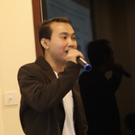

# Train the Trainer (TtT) Workshop

+ **Course Outline**
	+ Domain 1 : ***PreTraining Planing***
		+ Review of Organizational Needs and Learners' Backgrounds in Relationship to Course Objectives
		+ Instructional Environment in Relationship to Learning Objective
	+ Domain 2 : ***Methods and Media for Instructional Delivery***
		+ Selection and Implementation of Instructional Methods
		+ Use of Presentation and Instructional Media
	+ Domain 3 : ***Instructor Integrity and Communications***
		+ Instructor Delivery Competence and Content Expertise
		+ Instructor Communication and Presentation Skills
	+ Domain 4 : ***Group Facilitation***
		+ Establishment and Management of a Learner-Centered Environment
		+ Promotion of Learner Engagement and Participation
		+ Assessment of Learners' Needs for Additional Explanation and Encouragement
		+ Motivation and Positive Reinforcement of Learners
	+ Domain 5 : ***Motivation and Positive Reinforcement of Learners***
		+ Evaluation of Learner Performance during and at Close of Instruction
		+ Evaluation of Instructor and Course

+ **Course Details**
	+ Date : 
		+ Batch 1: **(Sat & Sun) June 7-8, 2025**
		+ Batch 2: **(Mon & Tue) June 23-24, 2025**
		+ Batch 3: **TBA**
	+ Time : **8:45 AM - 4:15 PM**
	+ Venue : **[Lao Airlines bldg.](https://maps.google.com/maps/dir//Lao+airlines+XJ74%2BG92+Vientiane/@17.9638166,102.605918,21z/data=!4m5!4m4!1m0!1m2!1m1!1s0x312469bdbab2b48f:0x92c0b3ecebaacf1d)**
	+ Course Fee : **4,999,000** LAK
	+ More Detail : [+856 **20 59 720 444**](https://api.whatsapp.com/send?phone=8562059720444)

+ **Instructor**
	+ ***Maykin Warasart***
		+ Approved Volunteer – Center for Cyber Safe and Education
		+ CompTIA Certified Technical Trainer (CTT+) – Classroom Trainer
		+ Microsoft Certified Trainer (MCT)
		+ Microsoft Certified Educator (MCE)
		+ Google Certified Educator (GCE) Level 1 & 2
		+ Linux Professional Institute (LPI) - Approved Trainer
		+ Modern Certified Classroom Trainer (MCCT) – Logical Operations
		+ CIW – Certified Instructor (CI)
		+ CAI – CertNexus Authorized Instructor
		+ ETDA Digital Citizen (EDC) Trainer
		+ Media Literacy Expert – Thai Media Fund
		+ Former Microsoft Most Valuable Professional (MVP)
+ **Guest Instructor(s)**

	                                      |

	
### "There's no one right way to teach — everyone has their own style!"

|:-----:|:------------------------------------------------------------------------------------------------------:|
| ***Boy*** - **Bounkong CHANTHAVI**    |             |
| ***Ham*** - **Sengphachanh SIPHAXAI** |             |
| ***Phet*** - **Sayphet KEOVANXAY**    |   |
| ***Pele*** - **Anousith VAYAKONE**    |                                       |